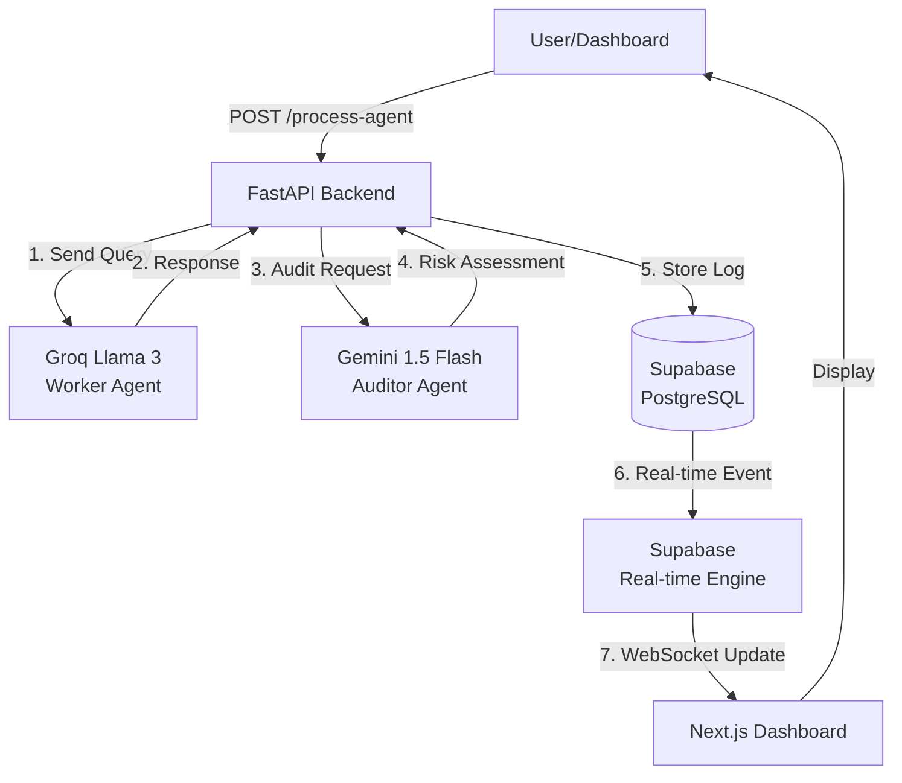

# Design Document: Agent Audit System

## Overview

The Agent Audit System is a real-time governance platform that provides transparency and oversight for AI agent operations. The system follows a pipeline architecture where user queries flow through a worker agent, get audited by a secondary agent, and are stored with risk assessments for real-time visualization.

The architecture consists of three main layers:
1. **Backend API Layer** (Python FastAPI) - Orchestrates the agent pipeline and manages data persistence
2. **AI Agent Layer** (Groq + Gemini) - Processes queries and performs risk auditing
3. **Frontend Dashboard Layer** (Next.js 15) - Provides real-time monitoring and testing interface

## Architecture

### System Architecture Diagram



### Data Flow

1. User submits a query through the dashboard or API
2. Backend forwards query to Groq (Worker Agent)
3. Worker Agent generates a response
4. Backend sends worker response to Gemini (Auditor Agent) with audit prompt
5. Auditor Agent returns risk assessment (score 0-10, detailed findings)
6. Backend calculates risk status (Safe/Warning/Flagged) based on score
7. Backend stores complete audit log in Supabase
8. Supabase triggers real-time event
9. Dashboard receives update via WebSocket and updates UI

## Components and Interfaces

### Backend Components

#### 1. FastAPI Application (`main.py`)

**Responsibilities:**
- HTTP request handling and routing
- CORS configuration
- Error handling and logging
- Application lifecycle management

**Key Endpoints:**
- `POST /process-agent` - Main query processing endpoint
- `GET /health` - Health check endpoint

**Configuration:**
```python
# CORS Configuration
origins = [os.getenv("FRONTEND_URL", "http://localhost:3000")]

# Middleware
- CORSMiddleware (allow credentials, methods, headers)
- Request logging middleware
```

#### 2. Agent Service (`services/agent_service.py`)

**Responsibilities:**
- Integration with Groq SDK for worker agent
- Integration with Gemini SDK for auditor agent
- Retry logic and error handling for external APIs
- Response parsing and validation

**Interface:**
```python
class AgentService:
    async def process_worker_query(query: str) -> WorkerResponse:
        """Send query to Groq Llama 3 and return response"""
        
    async def audit_response(response: str) -> AuditResult:
        """Send response to Gemini for risk assessment"""
```

**Data Models:**
```python
class WorkerResponse:
    content: str
    model: str
    tokens_used: int
    
class AuditResult:
    risk_score: int  # 0-10
    hallucination_detected: bool
    pii_detected: bool
    toxic_content_detected: bool
    details: str
    confidence: float
```

#### 3. Database Service (`services/database_service.py`)

**Responsibilities:**
- Supabase client initialization
- CRUD operations for audit logs
- Connection management and error handling

**Interface:**
```python
class DatabaseService:
    async def create_audit_log(
        query: str,
        response: str,
        audit: dict,
        status: str
    ) -> str:
        """Insert audit log and return UUID"""
        
    async def get_recent_logs(limit: int = 50) -> List[AuditLog]:
        """Retrieve recent audit logs"""
```

#### 4. Risk Calculator (`utils/risk_calculator.py`)

**Responsibilities:**
- Convert risk scores to status categories
- Calculate aggregate risk metrics

**Interface:**
```python
def calculate_risk_status(risk_score: int) -> str:
    """Convert score (0-10) to status (Safe/Warning/Flagged)"""
    # 0-3: Safe
    # 4-6: Warning
    # 7-10: Flagged
    
def calculate_average_risk(logs: List[AuditLog]) -> float:
    """Calculate average risk score across logs"""
```

### Frontend Components

#### 1. Main Dashboard Page (`app/page.tsx`)

**Responsibilities:**
- Layout and composition of dashboard components
- Real-time subscription management
- State management for logs and metrics

**Component Structure:**
```typescript
export default function DashboardPage() {
  // State
  const [logs, setLogs] = useState<AuditLog[]>([])
  const [averageRisk, setAverageRisk] = useState<number>(0)
  const [isConnected, setIsConnected] = useState<boolean>(false)
  
  // Real-time subscription
  useEffect(() => {
    const subscription = supabase
      .channel('logs')
      .on('postgres_changes', 
          { event: 'INSERT', schema: 'public', table: 'logs' },
          handleNewLog)
      .subscribe()
  }, [])
  
  return (
    <div className="dashboard-layout">
      <Header />
      <TestQueryInput />
      <RiskGauge averageRisk={averageRisk} />
      <AuditLogTable logs={logs} />
    </div>
  )
}
```

#### 2. Test Query Input (`components/TestQueryInput.tsx`)

**Responsibilities:**
- Accept user input for test queries
- Submit queries to backend API
- Display loading and error states

**Interface:**
```typescript
interface TestQueryInputProps {
  onQuerySubmit: (query: string) => Promise<void>
}

export function TestQueryInput({ onQuerySubmit }: TestQueryInputProps) {
  const [query, setQuery] = useState('')
  const [isLoading, setIsLoading] = useState(false)
  const [error, setError] = useState<string | null>(null)
  
  const handleSubmit = async () => {
    // POST to /process-agent
    // Handle response/errors
  }
}
```

#### 3. Risk Gauge (`components/RiskGauge.tsx`)

**Responsibilities:**
- Visualize average risk score using Tremor charts
- Color-code based on risk level
- Update in real-time

**Interface:**
```typescript
interface RiskGaugeProps {
  averageRisk: number  // 0-10
  totalLogs: number
}

export function RiskGauge({ averageRisk, totalLogs }: RiskGaugeProps) {
  // Use Tremor ProgressCircle or DonutChart
  // Color: Green (0-3), Yellow (4-6), Red (7-10)
}
```

#### 4. Audit Log Table (`components/AuditLogTable.tsx`)

**Responsibilities:**
- Display audit logs in tabular format
- Show status badges with color coding
- Handle pagination/virtualization for performance
- Display detailed audit information

**Interface:**
```typescript
interface AuditLogTableProps {
  logs: AuditLog[]
}

interface AuditLog {
  id: string
  created_at: string
  query: string
  response: string
  audit: AuditResult
  status: 'Safe' | 'Warning' | 'Flagged'
}

export function AuditLogTable({ logs }: AuditLogTableProps) {
  // Render table with Shadcn/ui Table component
  // Status badges with conditional styling
}
```

#### 5. Status Badge (`components/StatusBadge.tsx`)

**Responsibilities:**
- Display risk status with appropriate styling
- Provide consistent visual language

**Interface:**
```typescript
interface StatusBadgeProps {
  status: 'Safe' | 'Warning' | 'Flagged'
  riskScore?: number
}

export function StatusBadge({ status, riskScore }: StatusBadgeProps) {
  // Safe: Green badge
  // Warning: Yellow badge
  // Flagged: Red badge
}
```

## Data Models

### Database Schema

```sql
CREATE TABLE logs (
    id UUID PRIMARY KEY DEFAULT gen_random_uuid(),
    created_at TIMESTAMP WITH TIME ZONE DEFAULT NOW(),
    query TEXT NOT NULL,
    response TEXT NOT NULL,
    audit JSONB NOT NULL,
    status TEXT NOT NULL CHECK (status IN ('Safe', 'Warning', 'Flagged'))
);

CREATE INDEX idx_logs_created_at ON logs(created_at DESC);
CREATE INDEX idx_logs_status ON logs(status);
CREATE INDEX idx_logs_risk_score ON logs((audit->>'risk_score')::int);
```

### Audit JSONB Structure

```json
{
  "risk_score": 3,
  "hallucination_detected": false,
  "pii_detected": false,
  "toxic_content_detected": false,
  "details": "Response appears factual and safe. No concerning patterns detected.",
  "confidence": 0.95,
  "model": "gemini-1.5-flash",
  "timestamp": "2024-01-15T10:30:00Z"
}
```

### API Request/Response Models

**POST /process-agent Request:**
```json
{
  "user_query": "What is the capital of France?"
}
```

**POST /process-agent Response:**
```json
{
  "log_id": "550e8400-e29b-41d4-a716-446655440000",
  "query": "What is the capital of France?",
  "worker_response": "The capital of France is Paris.",
  "audit": {
    "risk_score": 0,
    "hallucination_detected": false,
    "pii_detected": false,
    "toxic_content_detected": false,
    "details": "Factually accurate response with no risks detected.",
    "confidence": 0.98
  },
  "status": "Safe",
  "created_at": "2024-01-15T10:30:00Z"
}
```

**Error Response:**
```json
{
  "error": "Worker agent failed to respond",
  "detail": "Connection timeout after 5 seconds",
  "status_code": 500
}
```

## Correctness Properties

*A property is a characteristic or behavior that should hold true across all valid executions of a system—essentially, a formal statement about what the system should do. Properties serve as the bridge between human-readable specifications and machine-verifiable correctness guarantees.*

Based on the prework analysis, here are the correctness properties for the Agent Audit System:

### Backend API Properties

Property 1: Empty query rejection
*For any* string composed entirely of whitespace characters, submitting it as a user_query should result in a validation error and no processing should occur.
**Validates: Requirements 1.5**

Property 2: Worker agent error handling
*For any* query where the worker agent fails to respond, the system should return an HTTP 500 error with a structured error message.
**Validates: Requirements 1.3**

Property 3: Audit trigger completeness
*For any* successful worker agent response, the system should send that response to the auditor agent exactly once.
**Validates: Requirements 2.1**

Property 4: Risk score validity
*For any* audit result received from the auditor agent, the risk_score field should be an integer between 0 and 10 inclusive.
**Validates: Requirements 2.3**

Property 5: Risk status classification
*For any* risk score value from 0-10, the calculated status should be "Safe" for scores 0-3, "Warning" for scores 4-6, and "Flagged" for scores 7-10.
**Validates: Requirements 2.4**

Property 6: Auditor failure fallback
*For any* query where the auditor agent fails to respond, the system should assign a risk status of "Warning" and log the error.
**Validates: Requirements 2.5**

Property 7: Audit log completeness
*For any* completed audit, the stored database record should contain non-empty values for query, response, audit (as valid JSON), and status fields.
**Validates: Requirements 3.1, 3.5**

Property 8: Unique log identifiers
*For any* two audit logs created by the system, their id values should be different valid UUIDs.
**Validates: Requirements 3.2, 9.2**

Property 9: Automatic timestamp generation
*For any* newly created audit log, the created_at timestamp should be within 5 seconds of the current time.
**Validates: Requirements 3.3, 9.3**

Property 10: Database error handling
*For any* audit where database storage fails, the API should return an error response with status code 500 and log the failure.
**Validates: Requirements 3.4**

Property 11: Audit JSON structure
*For any* stored audit log, the audit field should be valid JSON containing at minimum the fields: risk_score, hallucination_detected, pii_detected, and toxic_content_detected.
**Validates: Requirements 2.2, 9.4**

Property 12: CORS header presence
*For any* API response, the response headers should include Access-Control-Allow-Origin matching the configured frontend origin.
**Validates: Requirements 8.3**

Property 13: CORS origin validation
*For any* request from an origin not matching the configured FRONTEND_URL environment variable, the request should be rejected.
**Validates: Requirements 8.5**

Property 14: Environment variable configuration
*For any* of the required environment variables (GROQ_API_KEY, GEMINI_API_KEY, SUPABASE_URL, SUPABASE_KEY, FRONTEND_URL), if missing at startup, the system should fail to start with a clear error message indicating which variable is missing.
**Validates: Requirements 10.1, 10.2, 10.3, 10.4**

Property 15: Retry with exponential backoff
*For any* external API call that fails, the system should retry with exponentially increasing delays (e.g., 1s, 2s, 4s) up to a maximum number of attempts.
**Validates: Requirements 7.4**

Property 16: API interaction logging
*For any* call to an external API (Groq or Gemini), the system should create a log entry containing the request details and outcome.
**Validates: Requirements 7.5**

Property 17: Concurrent request handling
*For any* set of concurrent API requests, all requests should complete successfully without blocking each other.
**Validates: Requirements 11.2**

Property 18: Error response structure
*For any* error condition, the API response should include a JSON object with "error", "detail", and "status_code" fields, and the HTTP status code should match the status_code field.
**Validates: Requirements 12.2**

Property 19: Error classification
*For any* error response, client errors (invalid input, missing fields) should return 4xx status codes while server errors (external API failures, database errors) should return 5xx status codes.
**Validates: Requirements 12.4**

Property 20: Request logging
*For any* incoming API request, the system should log the request method, path, and processing outcome (success or error).
**Validates: Requirements 12.5**

Property 21: Error detail logging
*For any* error that occurs during processing, the system should log the error message and stack trace.
**Validates: Requirements 12.1**

### Frontend Dashboard Properties

Property 22: Real-time log display
*For any* new audit log inserted into the database, the dashboard should display it in the log table within the real-time subscription delay without requiring a page refresh.
**Validates: Requirements 4.2**

Property 23: Automatic reconnection
*For any* real-time subscription connection loss, the dashboard should attempt to reconnect automatically.
**Validates: Requirements 4.3**

Property 24: Connection status indicator
*For any* change in real-time subscription connection state (connected/disconnected), the dashboard should update the connection status indicator to reflect the current state.
**Validates: Requirements 4.4**

Property 25: Missed update synchronization
*For any* reconnection after a disconnection, the dashboard should fetch and display any audit logs that were created during the disconnection period.
**Validates: Requirements 4.5**

Property 26: Average risk calculation
*For any* set of audit logs, the displayed average risk score should equal the arithmetic mean of all risk_score values in the logs.
**Validates: Requirements 5.1**

Property 27: Status badge color mapping
*For any* audit log displayed in the table, the status badge color should be green for "Safe", yellow for "Warning", and red for "Flagged".
**Validates: Requirements 5.2**

Property 28: Risk gauge updates
*For any* new audit log added to the dashboard state, the risk gauge should recalculate and display the updated average risk score.
**Validates: Requirements 5.3**

Property 29: Risk score display
*For any* audit log entry displayed in the table, the risk score value from the audit field should be visible.
**Validates: Requirements 5.4**

Property 30: Test query submission
*For any* non-empty query submitted through the test input field, the dashboard should make a POST request to the /process-agent endpoint with the query.
**Validates: Requirements 6.2**

Property 31: Result display after submission
*For any* successful test query submission, the resulting audit log should appear in the real-time log table.
**Validates: Requirements 6.3**

Property 32: Loading state feedback
*For any* test query being processed, the dashboard should display a loading indicator until the response is received or an error occurs.
**Validates: Requirements 6.4**

Property 33: Error message display
*For any* API error response received by the dashboard, a user-friendly error message should be displayed to the user.
**Validates: Requirements 6.5, 12.3**

## Error Handling

### Backend Error Handling Strategy

1. **Input Validation Errors** (400 Bad Request)
   - Missing user_query field
   - Empty or whitespace-only queries
   - Malformed JSON payloads

2. **External API Errors** (500 Internal Server Error)
   - Worker agent (Groq) failures
   - Auditor agent (Gemini) failures
   - Implement retry logic with exponential backoff (1s, 2s, 4s, max 3 attempts)
   - Log all retry attempts and final outcomes

3. **Database Errors** (500 Internal Server Error)
   - Connection failures
   - Insert/query failures
   - Log detailed error information for debugging

4. **Configuration Errors** (Startup Failure)
   - Missing environment variables
   - Invalid API keys
   - Fail fast with clear error messages

### Frontend Error Handling Strategy

1. **API Communication Errors**
   - Network failures: Display "Unable to connect to server" message
   - Timeout errors: Display "Request timed out, please try again"
   - Server errors (5xx): Display "Server error occurred, please try again later"

2. **Real-time Subscription Errors**
   - Connection loss: Show disconnected status, attempt automatic reconnection
   - Reconnection failures: Display warning and provide manual reconnect button
   - Subscription errors: Log to console, attempt to resubscribe

3. **Validation Errors**
   - Empty query submission: Display "Please enter a query" message
   - Invalid input: Display specific validation error message

### Error Logging

All errors should be logged with:
- Timestamp
- Error type/category
- Error message
- Stack trace (for server errors)
- Request context (endpoint, method, payload)
- User context (if applicable)

## Testing Strategy

### Dual Testing Approach

The Agent Audit System requires both unit tests and property-based tests for comprehensive coverage:

**Unit Tests** focus on:
- Specific examples of valid and invalid inputs
- Edge cases (empty logs, zero risk scores, connection failures)
- Integration points between components
- Error conditions and error message formatting
- Specific UI component rendering

**Property-Based Tests** focus on:
- Universal properties that hold for all inputs
- Risk score classification across all possible values (0-10)
- Data persistence and retrieval correctness
- Concurrent request handling
- Real-time update propagation

### Backend Testing

**Framework**: pytest with pytest-asyncio for async tests
**Property Testing Library**: Hypothesis

**Test Categories**:

1. **API Endpoint Tests**
   - Unit tests for valid query processing
   - Unit tests for error responses (empty query, malformed JSON)
   - Property tests for concurrent request handling
   - Property tests for input validation across random strings

2. **Agent Service Tests**
   - Unit tests with mocked Groq/Gemini responses
   - Property tests for retry logic with simulated failures
   - Property tests for response parsing across various formats

3. **Database Service Tests**
   - Unit tests for CRUD operations
   - Property tests for UUID uniqueness
   - Property tests for timestamp generation
   - Property tests for JSON structure validation

4. **Risk Calculator Tests**
   - Property test for risk status classification (all scores 0-10)
   - Property test for average risk calculation
   - Unit tests for edge cases (empty log list, single log)

5. **CORS and Security Tests**
   - Unit tests for allowed origin requests
   - Property tests for unauthorized origin rejection
   - Property tests for CORS header presence

**Property Test Configuration**:
- Minimum 100 iterations per property test
- Each test tagged with: **Feature: agent-audit, Property {number}: {property_text}**

### Frontend Testing

**Framework**: Jest + React Testing Library
**Property Testing Library**: fast-check

**Test Categories**:

1. **Dashboard Page Tests**
   - Unit tests for initial render
   - Unit tests for empty state display
   - Property tests for real-time subscription handling
   - Property tests for state updates on new logs

2. **Test Query Input Tests**
   - Unit tests for form submission
   - Unit tests for loading states
   - Property tests for API call triggering
   - Property tests for error display

3. **Risk Gauge Tests**
   - Property test for average calculation across random log sets
   - Unit tests for color coding at boundary values (3, 4, 6, 7)
   - Unit tests for zero state

4. **Audit Log Table Tests**
   - Unit tests for rendering with sample data
   - Property tests for status badge color mapping
   - Property tests for risk score display
   - Unit tests for pagination/virtualization

5. **Real-time Subscription Tests**
   - Unit tests for connection/disconnection
   - Property tests for automatic reconnection
   - Property tests for missed update synchronization
   - Unit tests for connection status indicator

**Property Test Configuration**:
- Minimum 100 iterations per property test
- Each test tagged with: **Feature: agent-audit, Property {number}: {property_text}**

### Integration Testing

**End-to-End Flow Tests**:
1. Submit query → Worker processes → Auditor evaluates → Database stores → Dashboard displays
2. Connection loss → Reconnection → Missed updates synchronized
3. Worker failure → Error handling → Error display
4. Concurrent queries → All complete successfully

**Tools**: Playwright for E2E tests, pytest for backend integration tests

### Test Data Generation

**For Property Tests**:
- Random queries (various lengths, characters, languages)
- Random risk scores (0-10)
- Random audit results (all combinations of boolean flags)
- Random timestamps
- Random UUIDs
- Random connection states

**For Unit Tests**:
- Specific examples: "What is AI?", "Tell me about Paris"
- Edge cases: "", "   ", very long queries (10000+ chars)
- Boundary values: risk scores 0, 3, 4, 6, 7, 10
- Error scenarios: network timeouts, invalid API keys, database connection failures

## Performance Considerations

1. **Async Processing**: All I/O operations (API calls, database queries) use async/await
2. **Connection Pooling**: Supabase client maintains connection pool
3. **Real-time Efficiency**: WebSocket connection for dashboard updates (no polling)
4. **Frontend Optimization**: 
   - Virtual scrolling for large log lists
   - Debounced search/filter inputs
   - Memoized calculations for average risk
5. **Caching**: Consider caching recent logs in memory for faster dashboard loads
6. **Rate Limiting**: Implement rate limiting on API endpoints to prevent abuse

## Deployment Considerations

1. **Environment Variables**: All sensitive configuration via environment variables
2. **Health Checks**: /health endpoint for monitoring and load balancer checks
3. **Logging**: Structured logging (JSON format) for easy parsing and analysis
4. **Monitoring**: Track API response times, error rates, external API latency
5. **Scaling**: Stateless backend design allows horizontal scaling
6. **Database**: Supabase handles scaling and backups automatically